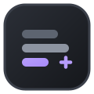

# Prompt Studio

<p align="center">
  
</p>

Prompt Studio is a multimodal prompt-writing workspace for ComfyUI. Pick a generation target, write a plain-language Creative Brief, add optional media references, and generate an editable prompt in the format that target expects.

> Prompt Studio is heavily inspired by and forked from [duckyshell/ComfyUI-MiniMaxH3-Prompt-Writer](https://github.com/duckyshell/ComfyUI-MiniMaxH3-Prompt-Writer). That project is the original work this one grew out of; credit for the concept and the original H3 writing flow belongs there. Prompt Studio generalizes it into a multi-target studio.

It is a ComfyUI UI extension, not a workflow node. It writes prompt text for your existing workflow and helps prepare reference media. The optional Media panel can add media loaders to your workflow. Prompt Studio does not run the generation models themselves and does not queue renders.

**ComfyUI extension**: **1.0.0** · [Download ZIP](../../releases/download/v1.0.0/Prompt-Studio-ComfyUI-v1.0.0.zip) · [Installation](docs/INSTALLATION.md)

**Standalone for Windows**: **1.1.0** · [Download ZIP](../../releases/download/standalone-v1.1.0/Prompt-Studio-Standalone-Windows-v1.1.0.zip) · [Setup guide](standalone/README.md)

## Supported generation targets

A generation target is the model a prompt is written *for*. Targets are grouped by the kind of output they produce.

### Video

| Target | Modes |
| --- | --- |
| MiniMax H3 | `T2VA` · `I2VA` · `FL2VA` · `L2VA` · `Ref2VA` |

### Image

| Target | Modes |
| --- | --- |
| Qwen Image 2.1 | `T2I` · `Edit` |
| Krea 2 | `T2I` |

### Audio

| Target | Modes |
| --- | --- |
| MiniMax Music 3 | `Caption` · `Lyrics` |

Targets are declared as data in [`targets.json`](targets.json) and resolved by [`backend/targets/`](backend/targets/), so supporting another model means adding a descriptor plus a strategy module rather than editing core logic. The generation target is separate from the *prompt model* — the local or remote LLM that actually writes the prompt. See [generation targets](docs/TARGETS.md) for modes, media limits, and output contracts.

## Highlights

- Multiple generation targets across three categories: video, image, and audio prompts from one workspace, with per-target modes, limits, and output contracts.
- Sequence: write several independent prompts from one brief, with shared media and per-chunk edits. See [targets](docs/TARGETS.md).
- Media Composer: combine pictures and video contact sheets into a collage.
- Media Editor: crop images, trim and crop video, and extract frames.
- Floating Media panel: drag Prompt Studio media into ComfyUI workflows.
- Local and remote prompt models: Ollama, Direct GGUF, External llama.cpp, and APIs.
- Standalone for Windows, plus a Linux launcher for repository checkouts.
- Light theme, adjustable interface size, and Auto VRAM management.

## Releases

**v0.4.6**: Sequence workspace with Official and Compact output, internal planning, format recovery, shared highlighting, and per-chunk refinement.\
**v0.4.5**: Media Composer, Media Editor, Floating Media, themes, and runtime improvements.\
**v0.4.4**: Standalone, Qwen 3.8 and Qwen3-VL, expanded Direct GGUF support.\
**v0.3**: Redesigned Prompt Studio, Ollama/API/External setup, and per-mode drafts.

See the [Changelog](CHANGELOG.md) for the full history.

## What it does

You do not need to write MiniMax section headings, timestamps, or reference syntax by hand. Describe what you want and tell Prompt Studio what each reference should contribute:

```text
Use <Picture 1> for character appearance, <Picture 2> for clothes, and only the movement from <Video 1>. The character walks through a rainy Tokyo street at night.
```

Prompt Studio sends your brief, selected mode, prepared references, and the selected writing contract to the prompt model. Single and Official Sequence use the target's official guide. Compact Sequence uses descriptive prose with brief sound and music fields. The result is an editable prompt. You can change it directly, use **Refine** for a revision, or select **Copy prompt** and paste it into your workflow.

## Key features

- Sequence workspace: plan a longer brief across editable chunks, with Official structure or Compact descriptive prose. See [Sequence usage](docs/USAGE.md#sequence).
- MiniMax H3 video modes: T2VA, I2VA, FL2VA, L2VA, and Reference.
- Up to 9 images, 3 videos, and 3 audio references in H3 Reference mode.
- Clear `<Picture N>`, `<Video N>`, and `<Audio N>` labels for assigning identity, wardrobe, setting, motion, camera, sound, or other roles.
- Qwen Image 2.1 text-to-image and instruction-driven image editing, with `<imageN>` references.
- Krea 2 text-to-image prompts, using Krea's minimal-prompt guidance rather than a section schema.
- MiniMax Music 3 structured captions and lyrics.
- In-place Reference media replacement from the card action or by dropping one file directly on a card, without rebuilding the surrounding asset order.
- Ordered video contact sheets with visible frame-sampling controls, so you can inspect what the prompt model sees.
- Official guides included and pinned for MiniMax H3, Qwen Image 2.1, and Krea 2, so a prompt is written against the upstream contract.
- Editable prompts, **Refine**, **Copy prompt**, and a separate saved draft for every mode.
- Automatic context planning and clear controls for releasing local prompt models and ComfyUI VRAM.

See [Writing a useful Creative Brief](docs/USAGE.md#writing-a-useful-creative-brief) for practical examples.

## Choose a provider

| Provider | Choose it when | Setup |
| --- | --- | --- |
| [Ollama](docs/OLLAMA.md) | You want the simplest local setup | Install Ollama and pull a vision model |
| [Direct GGUF](docs/DIRECT_GGUF.md) | You want Prompt Studio to load a supported GGUF inside ComfyUI | Install the optional native runtime and add a matching GGUF + `mmproj` pair |
| [External llama.cpp](docs/EXTERNAL_LLAMA_SERVER.md) | You already run llama.cpp or want full control over its runtime | Start `llama-server`; add a matching `mmproj` for images and video |
| [API providers](docs/API_PROVIDERS.md) | You want Gemini, OpenAI, OpenRouter, or a Custom OpenAI-compatible endpoint | Connect a key or an existing endpoint such as LM Studio |

Not sure? Start with [Ollama](docs/OLLAMA.md). The [provider guide](docs/PROVIDERS.md) explains the differences. The Ollama and Direct GGUF guides contain the tested local model choices.

## Quick start

1. Install **MiniMax Prompt Studio** from ComfyUI Manager and restart ComfyUI.
2. Open the floating **Prompt Studio** button or use **Extensions > Prompt Studio**. No graph node will appear.
3. Open **Settings** and choose a provider. For the recommended local setup and an 8 GB starting tier, install [Ollama](https://ollama.com/download), open the app, and run:

   ```text
   ollama pull gemma4:e4b
   ```

4. Choose a mode, add its media, and write a Creative Brief.
5. Select **Generate prompt**, review the editable result, then copy it into your workflow.

For Git, ZIP, Windows Portable, update, and provider-specific steps, see [Installation](docs/INSTALLATION.md).

## Platforms

Prompt Studio runs inside ComfyUI on Windows, Linux, and macOS, and follows whatever platform your ComfyUI installation uses.

**Standalone** runs without ComfyUI. The packaged download is named for Windows and ships `start.bat`, but the same Python backend and browser interface run on Linux too:

| Platform | Launcher | Notes |
| --- | --- | --- |
| Windows | `start.bat` | Included in the released ZIP |
| Linux | `start-linux.sh` | Repository checkouts only — not bundled in the ZIP |

On Linux, run Standalone from a full clone rather than the `.zip` build artifact:

```bash
chmod +x start-linux.sh
./start-linux.sh
```

The launcher creates `.venv`, installs the requirements, and runs the same entry point as `start.bat`. Python 3.10 or newer is required, and the Linux launcher has been tested on WSL2. Managed Local GGUF is Windows-only, so on Linux use External llama.cpp or Ollama. See the [Standalone guide](standalone/README.md#linux) for details.

## Privacy and limitations

- With Direct GGUF, External llama.cpp, a local Custom endpoint, or Ollama on this computer, the prompt request and prepared media stay on the local machine. A remote Ollama host receives the brief, instructions, and prepared visual inputs.
- With a remote API provider, the required brief, instructions, prepared images, and video contact sheets are sent to the selected provider. Original video and audio bytes are not uploaded by Prompt Studio. Read [What leaves this computer](docs/API_PROVIDERS.md#what-leaves-this-computer) before using private media.
- Video understanding uses the ordered contact sheet shown in the preview, not every frame of the encoded video.
- Prompt models do not listen to uploaded audio. Describe the soundtrack, voice, rhythm, or other audio role in the Creative Brief.
- The interface and documentation are in English. Briefs can use other languages, and Prompt Studio preserves supplied dialogue and visible text.
- Gemma 4 remains the simplest tested local choice. Direct GGUF also supports Qwen 3.8, compatible Qwen 3.8 fine-tunes, and Qwen3-VL. Untested compatible models may behave differently from the verified pairs.
- Ollama, External llama.cpp, and compatible API endpoints let you try other multimodal models that accept images. Compatibility does not guarantee a good prompt for every target.
- External llama.cpp also accepts text-only models for Music 3, T2VA, and Refine. Image and video requests still need a vision model.
- Direct GGUF supports Gemma 4, Qwen 3.8, compatible Qwen 3.8 fine-tunes, and Qwen3-VL. The tested Qwen 3.8 and Qwen3-VL model and projector pairs are marked as verified. Other compatible combinations are marked as unverified. A missing projector leaves text-only T2VA and Music3 available.
- Gemini and a Custom OpenAI-compatible endpoint were tested live. OpenAI and OpenRouter have automated contract coverage but were not tested live with commercial credentials. Comfy Cloud has not been validated for v0.3.

## Documentation

- [Installation](docs/INSTALLATION.md)
- [Using Prompt Studio](docs/USAGE.md)
- [Choose a provider](docs/PROVIDERS.md)
- [Ollama](docs/OLLAMA.md)
- [Direct GGUF](docs/DIRECT_GGUF.md)
- [External llama.cpp](docs/EXTERNAL_LLAMA_SERVER.md)
- [API providers](docs/API_PROVIDERS.md)
- [Troubleshooting](docs/TROUBLESHOOTING.md)
- [Changelog](CHANGELOG.md)
- [Extension release notes](RELEASE_NOTES.md)
- [Standalone guide](standalone/README.md) · [Standalone release notes](standalone/RELEASE_NOTES.md)

The project is released under the [MIT License](LICENSE). MiniMax H3 guides and model files keep their upstream terms, and the Qwen Image 2.1 guides keep theirs. Model weights are not bundled with this extension.

Prompt Studio is forked from [duckyshell/ComfyUI-MiniMaxH3-Prompt-Writer](https://github.com/duckyshell/ComfyUI-MiniMaxH3-Prompt-Writer); the original project's license and terms continue to apply to the work it contributed.
